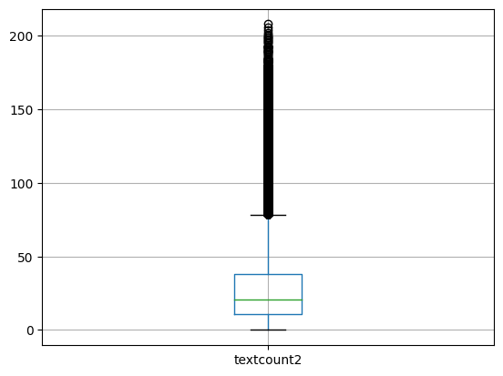

## NLP Engineer Challenge
1. Explore dataset via `notebooks/dataset_analysis1.ipynb` and `notebooks/preproess_text1.ipynb`.
   - Findings: 
     - There are 9 labels in L1, 70 in L2, 219 in L3. 
     - Among 342781 rows of data, there are texts having more than 300 words. 
   - Preprocessing:
     - To improve the prediction performance, stopwords and non-english words are filtered. They are then lemmatized, and repetitive words in the same text are filtered as well. 
     - The inputs of the models are the rows which have processed text of less than 100 words. 
     - The following is the distribution of the word count in each processed text, 
     
2. Model Selection via `notebooks/train_trial1.ipynb`.
   - There are 2 naive deep learning model architectures that can probably solve this problem.

     |Model|Advantages|Disadvantages|
     |---|---|---|
     |Word-Embedding+<br>RNN|- Simple <br>- Can use Context <br>Embedding for relationships<br>between hierarchical categories. |- Too many classifiers needed<br> - Repetitive to have<br> many classifier for each layer<br> classification|
     |Seq2seq <br>Encoder-Decoder<br> Attention Model|- Decoder infers <br>hierarchical logic|- Have not trained one before, <br>don't know what to expect.|
   - So I decided to adopt the second approach, used the encoder-decoder architecture to make sequence (sentence) to sequence (3 labels) prediction. The reasons I chose the second one is that the decoder shows the hierarchical structure the question is looking for, like a n-gram model. 
   - After 75000 iterations, accuracies in L1,L2 and L3 are 93.08%, 85.04% and 77.04%. The overall accuracy is 75.77%.
   
   - If I have more time, I may do some pruning and quantization to optimize the neural network. Make better preprocessing for the data, since my current preprocessing steps are not considering the sentence structure, but just treating the sentences as bag of words.

3. Deployments
   - `train.py` a script to call `data/preprocess.py` to preprocess csv and convert it to `pairs.txt` as dictionaries for inputs and outputs, and train the models. It saves losses, accuracies, test cases and weights every `saveInterval` iterations. Here is the command line, 
   ```
   python train.py [--csv classification_dataset.csv][--pairs_txt pairs.txt] 
    [--seed 1][--split 0.99][--logdir log/run][--checkpoint weight/run]
    [--iters 75000][--saveIntervals 1000][--lr 0.01]
   ```
   - To run tensorboard, simply,
   ```
   tensorboard --logdir log/run
   ```
   - `predict.py` simply initializes the given models, and preprocess the input text and predict the result. 
   ```
   python predict.py [--weightE weight/run/encoder-75000.pth]
    [--weightD weight/run/attn_decoder-75000.pth][--pairs_txt pairs.txt]
    [--sentence 'He was a pupil of the painter Denis Calvaert, then of Guido Reni.']
   ```