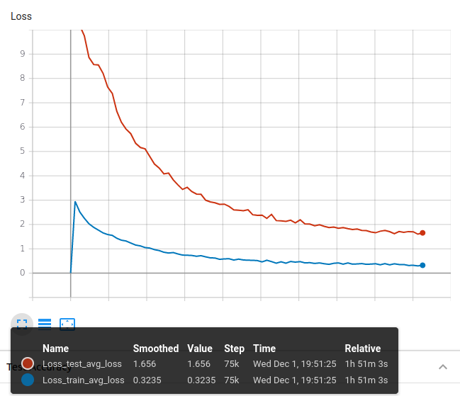

## Sequence-to-sequence Hierarchical Categories Classification
The repo proposes a method to classify hierarchical labels, from level 1 to level3. There are 9 labels in l1, 70 in l2 ad 219 in l3, each label in layer n has different distribution of labels in next layer n+1. 

### How to run?
1. Install the required packages,
```
pip install -r requirements.txt
```
2. Train the network via,
```
python train.py [--csv classification_dataset.csv][--pairs_txt pairs.txt] 
 [--seed 1][--split 0.99][--logdir log/run][--checkpoint weight/run]
 [--iters 75000][--saveIntervals 1000][--lr 0.01]
```
3. View training progress via tensorboard,
```
tensorboard --logdir log/run
```
4. Predict the new sentence via,
```
python predict.py [--weightE weight/run/encoder-75000.pth]
 [--weightD weight/run/attn_decoder-75000.pth][--pairs_txt pairs.txt]
 [--sentence 'He was a pupil of the painter Denis Calvaert, then of Guido Reni.']
```

### Results
|Test Accuracy|Loss|
|---|---|
|||

<table>
    <thead>
        <tr>
            <th></th>
            <th colspan=3>Output (Ground Truth</th>
        </tr>
       <tr>
            <th>Preprocessed Test Case</th>
            <th>l1</th>
            <th>l2</th>
            <th>l3</th>
        </tr>
    </thead>
        <tr>
            <td>bishop cathedral catholic church community diocesan diocese heart home know mother new parish present recently sacred seat well york</td>
            <td>place</td>
            <td>building</td>
            <td>historicbuilding</td>
        </tr>
        <tr>
            <td>born footballer german marcel retire</td>
            <td>agent</td>
            <td>athlete</td>
            <td>soccerplayer</td>
        </tr>
        <tr>
            <td>accepted also alumnus anonymous artist bachelor certificate college conjunction diploma doctor donation full graduate joint later master million music musical offering one performance professional program reveal school three twelve university yale</td>
            <td>agent</td>
            <td>person (educationalinstitution)</td>
            <td>journalist (university)</td>
        </tr>
        <tr>
         <td>Test Accuracy</td>
         <td>93.08%</td>
         <td>85.04%</td>
         <td>77.02%</td>
        </tr>
        <tr>
         <td>Overall</td>
         <td colspan=3>75.77%</td>
        </tr>

</table>

